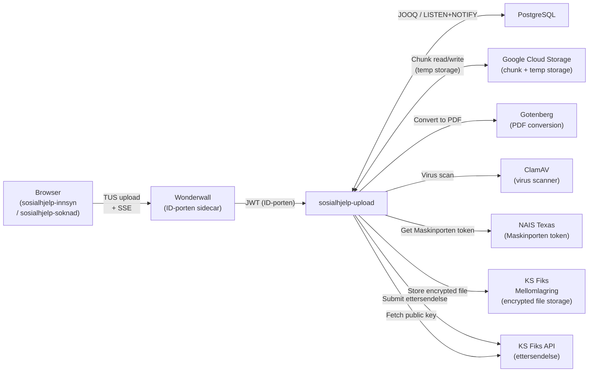
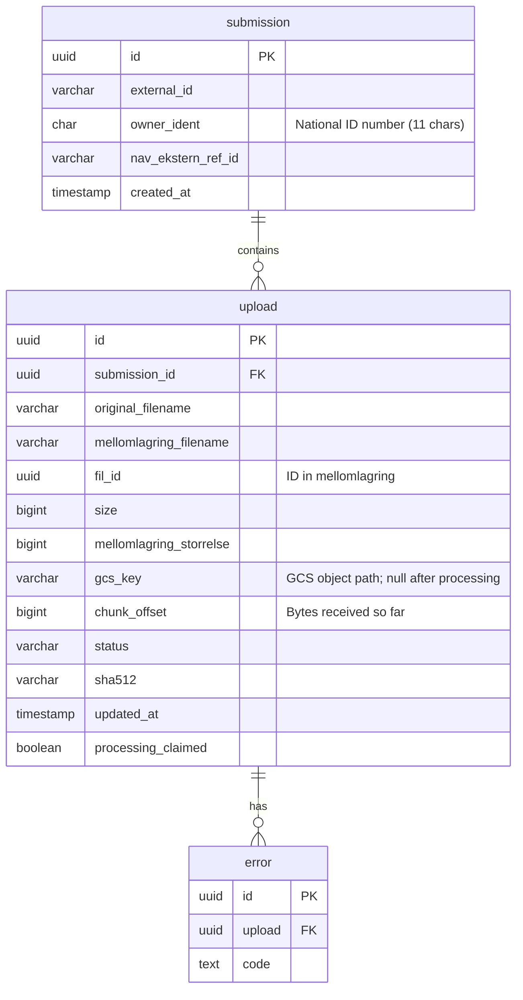
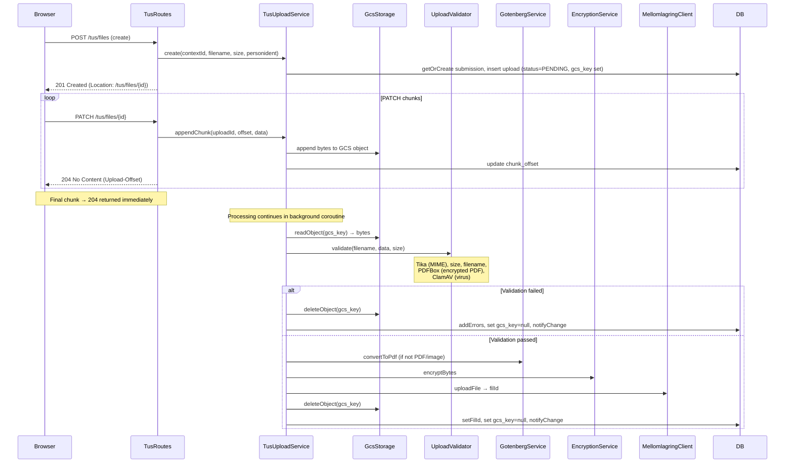
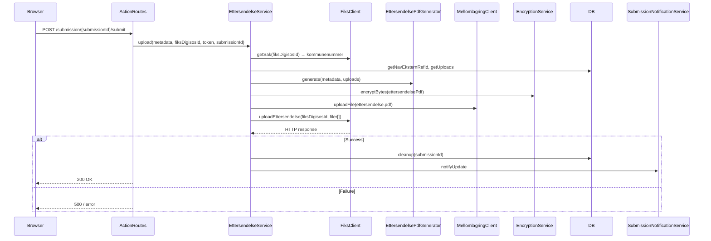
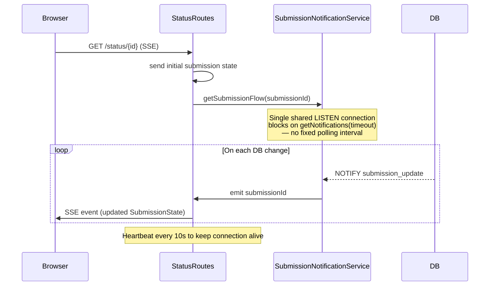
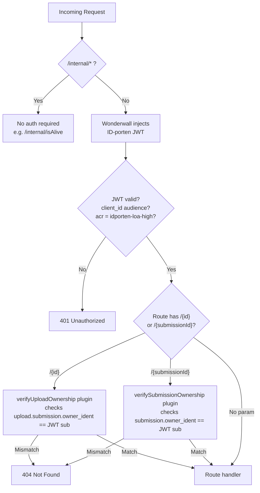
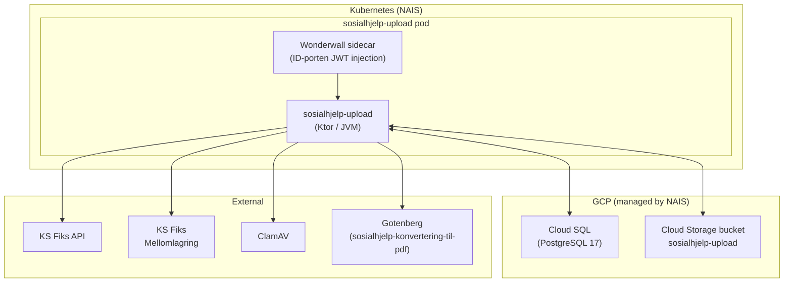

# Architecture: sosialhjelp-upload (v2 — Target Architecture)

> This document describes the **target architecture** after migrating file chunk storage from PostgreSQL `bytea` to Google Cloud Storage (GCS). For the current as-built architecture see [ARCHITECTURE.md](./ARCHITECTURE.md).

## Purpose

`sosialhjelp-upload` is a backend service for NAV's digital social assistance applications ([sosialhjelp-innsyn](https://github.com/navikt/sosialhjelp-innsyn) and [sosialhjelp-soknad](https://github.com/navikt/sosialhjelp-soknad)). It enables citizens to upload supporting documents (attachments / _ettersendelser_) as part of their social assistance case.

The service handles the full lifecycle of a file upload:
1. Receives chunked file uploads from the browser using the [TUS resumable upload protocol](https://tus.io/)
2. Streams each chunk directly to GCS as it arrives
3. Validates files on final chunk (type, size, virus scan, PDF integrity)
4. Converts non-PDF/image documents to PDF via Gotenberg
5. Encrypts files using CMS (Cryptographic Message Syntax) with the recipient's public key
6. Stores encrypted files temporarily in KS Fiks mellomlagring
7. Submits a bundle of uploaded files (_ettersendelse_) to the KS Fiks API
8. Streams real-time upload status to connected clients via Server-Sent Events (SSE)

---

## Key Changes from v1

| Area | v1 (current) | v2 (target) |
|---|---|---|
| **Chunk storage** | `bytea` column in PostgreSQL | Google Cloud Storage |
| **TUS implementation** | Kotlin in-process | Kotlin in-process (unchanged) |
| **Infrastructure** | `sosialhjelp-upload` + `sosialhjelp-tusd` (separate) | `sosialhjelp-upload` only |
| **GCS ownership** | Owned by tusd NAIS Application | Owned by `sosialhjelp-upload` |
| **PATCH response** | Blocked until full pipeline completes | 204 returned immediately; processing is async |
| **LISTEN/NOTIFY** | 500ms polling loop | Blocking `getNotifications(timeout)` |
| **Processing recovery** | Read `bytea` from DB | Read partial/complete object from GCS |

---

## Technology Stack

| Layer | Technology |
|---|---|
| Language | Kotlin |
| Server framework | [Ktor](https://ktor.io/) (Netty engine) |
| Dependency injection | Ktor built-in DI (`ktor-server-di`) |
| Database | PostgreSQL |
| Query builder | [JOOQ](https://www.jooq.org/) (type-safe SQL, generated classes committed) |
| DB migrations | [Flyway](https://flywaydb.org/) |
| **File storage** | **Google Cloud Storage (GCS)** |
| File type detection | [Apache Tika](https://tika.apache.org/) |
| PDF validation | [Apache PDFBox](https://pdfbox.apache.org/) |
| PDF generation | Internal (`EttersendelsePdfGenerator`) using iText/font resources |
| Encryption | [ks-kryptering](https://github.com/ks-no/ks-kryptering) — CMS/PKCS#7 via BouncyCastle |
| Metrics | [Micrometer](https://micrometer.io/) + Prometheus |
| Async | Kotlin Coroutines |
| HTTP client | Ktor CIO client |
| Serialization | kotlinx.serialization + Jackson (for Fiks API) |

---

## External Integrations



| Integration | Purpose | Auth |
|---|---|---|
| **ID-porten** (via Wonderwall) | JWT auth for all user-facing routes | Bearer token (validated against JWKS) |
| **Google Cloud Storage** | Temporary storage for upload chunks; cleaned up after processing | NAIS Workload Identity (no credentials needed) |
| **KS Fiks mellomlagring** | Temporary encrypted file storage before final submission | Maskinporten token (via Texas) |
| **KS Fiks API** | Final submission of ettersendelse; also provides the encryption public key | Maskinporten token (via Texas) + integrasjonId/passord |
| **Gotenberg** | Converts Office/text documents to PDF | None (internal) |
| **ClamAV** | Virus scanning of uploaded file bytes | None (internal) |
| **NAIS Texas** | Acquires Maskinporten tokens scoped to `ks:fiks` | NAIS workload identity |

---

## Core Domain Concepts

- **Submission** — a named group of uploads tied to a single case. Maps to the `submission` DB table. Identified externally by `externalId` (from the frontend). Gets assigned a `navEksternRefId` which references the submission at Fiks.
- **Upload** — an individual file within a submission. Progresses through states: `PENDING` → `PROCESSING` → `COMPLETE` / `FAILED`. Maps to the `upload` DB table.

---

## Database Schema

The `chunk_data` column is removed. GCS holds the raw bytes during the upload window; only metadata lives in the database.



Migrations live in `src/main/resources/db/migration/` following `V{major}.{minor}__{description}.sql`. JOOQ-generated classes are committed under `database/generated/` and must be regenerated (`./gradlew generateJooq`) when the schema changes.

---

## GCS Bucket Layout

Each in-progress upload gets a dedicated GCS object. The key is the upload UUID, scoped by environment prefix to allow multiple environments sharing an account.

```
sosialhjelp-upload/
└── uploads/
    └── {uploadId}          ← raw bytes, deleted after successful processing
```

The NAIS Application owns the bucket via `spec.gcp.buckets`. NAIS provisions the bucket and binds the pod's Workload Identity service account to it automatically — no secret credentials are needed.

```yaml
# nais.yaml (relevant excerpt)
spec:
  gcp:
    buckets:
      - name: sosialhjelp-upload
        lifecycleCondition:
          age: 2   # Auto-delete objects after 2 days (safety net)
    sqlInstances:
      - type: POSTGRES_17
        ...
```

---

## Upload Lifecycle

Chunks are streamed to GCS as they arrive. The final PATCH responds immediately with 204; post-processing runs asynchronously in a background coroutine so the client is never blocked waiting for validation, conversion, encryption, or mellomlagring upload.



---

## Submission Flow

Once all files are uploaded and the user triggers submission, `EttersendelseService` reads file metadata from the DB (files are already in mellomlagring), generates an ettersendelse cover PDF, and submits the bundle to Fiks. No GCS access is needed at this stage.



---

## Real-time Status Streaming (SSE)

Upload status is pushed to connected clients without polling, using Postgres `LISTEN/NOTIFY` as a lightweight message bus.



A single long-lived Postgres connection listens on the `submission_update` channel using `PGConnection.getNotifications(timeoutMs)` (blocking wait, not a polling loop). Change events are fanned out to all active SSE subscribers via a `SharedFlow`, so the number of DB connections does not grow with the number of connected clients.

---

## Security



- All routes under `/sosialhjelp/upload/` require a valid ID-porten JWT injected by the Wonderwall sidecar.
- JWT is validated in `Security.kt`: audience, issuer, and `acr=idporten-loa-high`.
- Ownership is enforced by Ktor route-scoped plugins in `OwnershipInterceptors.kt`. On failure the response is `404 Not Found` (not 403) to avoid leaking resource existence.
- The JWT `sub` claim is used as `personident` throughout.
- GCS objects are accessed only via the pod's Workload Identity — no signed URLs, no public objects.

---

## Background Services

Two background coroutines run continuously on application start:

| Service | Interval | Purpose |
|---|---|---|
| `UploadRecoveryService` | 1 minute | Re-processes uploads stuck in `PROCESSING` state by re-reading bytes from GCS (falls back to marking failed if GCS object is missing) |
| `RetentionService` | 1 minute | Deletes stale submissions (uploads and GCS objects) that were never submitted |

---

## Infrastructure / NAIS



Key NAIS features used:

| Feature | How used |
|---|---|
| `spec.gcp.buckets` | Provisions the GCS bucket and grants the pod Workload Identity access |
| `spec.gcp.sqlInstances` | Provisions the Cloud SQL (PostgreSQL 17) instance |
| `spec.maskinporten` | Injects Maskinporten credentials for the `ks:fiks` scope via NAIS Texas |
| Wonderwall sidecar | Handles ID-porten OIDC flow; injects `Authorization: Bearer` on all requests |
| `spec.accessPolicy` | Zero-trust network: only explicitly listed apps/hosts can communicate |

---

## Package Structure

```
no.nav.sosialhjelp.upload
├── action/          # EttersendelseService, FiksClient, MellomlagringClient, EncryptionService
├── database/        # JOOQ repositories, Flyway, SubmissionNotificationService (LISTEN/NOTIFY)
│   ├── generated/   # JOOQ-generated table/record classes (committed, do not edit)
│   └── notify/      # Postgres LISTEN/NOTIFY → SharedFlow fan-out
├── documents/       # GET /upload/{uploadId} — retrieves a file from mellomlagring
├── pdf/             # GotenbergService (conversion), EttersendelsePdfGenerator
├── status/          # SSE /status/{id}, SubmissionService
├── storage/         # Storage interface, GcsBucketStorage, FileSystemStorage (local dev)
├── texas/           # TexasClient — Maskinporten token via NAIS Texas
├── tus/             # TUS protocol routes and TusUploadService
└── validation/      # UploadValidator (Tika, PDFBox, ClamAV, size, filename)
```

The `storage/` package exposes a simple interface:

```kotlin
interface ChunkStorage {
    suspend fun write(key: String, offset: Long, data: ByteArray)
    suspend fun read(key: String): ByteArray
    suspend fun delete(key: String)
    suspend fun exists(key: String): Boolean
}
```

`GcsBucketStorage` implements this using the Google Cloud Storage client library with `InsertChannel` for streaming writes. `FileSystemStorage` is used in local development so no GCS credentials are needed.

---

## Local Development

```bash
# Start local dependencies (Postgres on :54322, Gotenberg on :3010)
docker compose up -d

# Run with development mode (mock encryption, mock Fiks, filesystem chunk storage)
./gradlew run -Pdevelopment

# Run tests (requires Docker for Testcontainers/Postgres)
./gradlew test

# Regenerate JOOQ classes after schema changes
./gradlew generateJooq
```

In `local`/`mock` mode (`RUNTIME_ENV`), `FileSystemStorage` is used instead of `GcsBucketStorage`, writing chunks to a temp directory. No GCS credentials or emulator are needed.

Key environment variables (see `application.yaml` for defaults):

| Variable | Purpose |
|---|---|
| `RUNTIME_ENV` | `local`/`mock` uses no-op encryption, mock Fiks, and filesystem storage |
| `POSTGRES_JDBC_URL` / `_USERNAME` / `_PASSWORD` | Database |
| `IDPORTEN_CLIENT_ID` / `_ISSUER` / `_JWKS_URI` | JWT auth |
| `GOTENBERG_URL` | PDF conversion |
| `FIKS_URL` / `INTEGRASJONSID_FIKS` / `INTEGRASJONPASSORD_FIKS` | KS Fiks |
| `CLAMAV_URL` | Virus scanner |
| `NAIS_TOKEN_ENDPOINT` | Texas Maskinporten token endpoint |
| `BUCKET_NAME` | GCS bucket name (auto-set by NAIS in cloud environments) |
