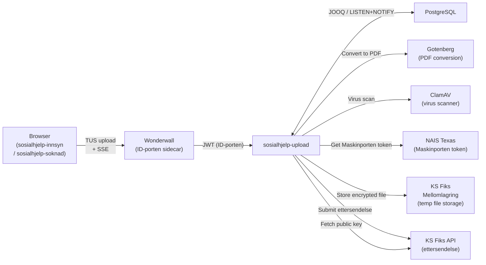
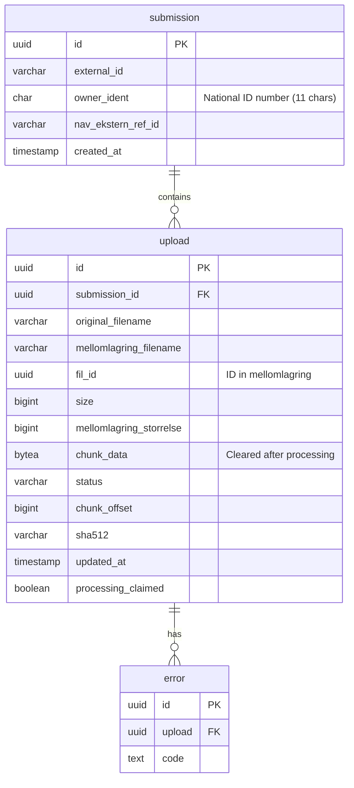
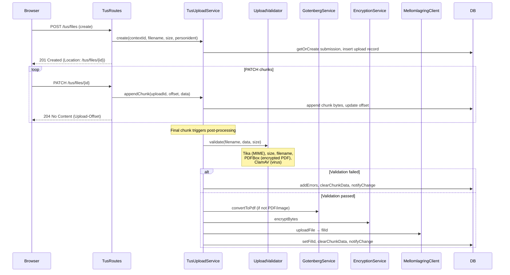
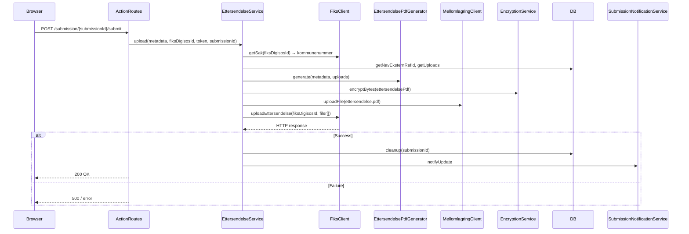
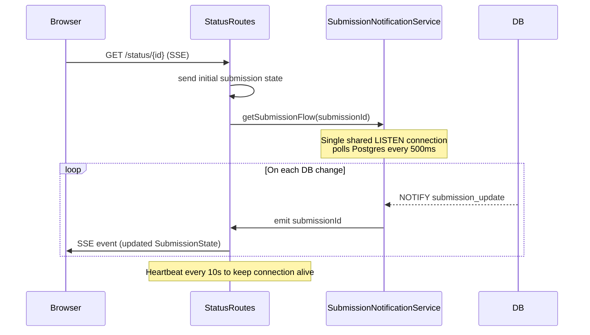
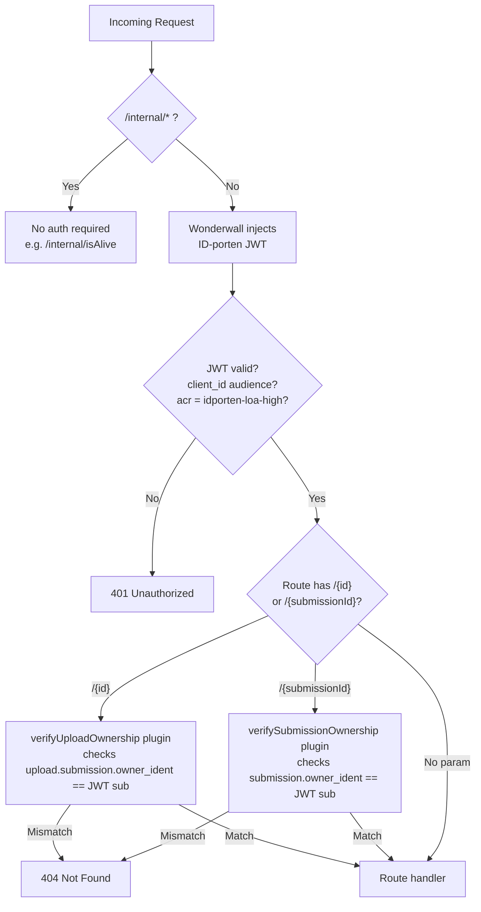

# Architecture: sosialhjelp-upload

## Purpose

`sosialhjelp-upload` is a backend service for NAV's digital social assistance applications ([sosialhjelp-innsyn](https://github.com/navikt/sosialhjelp-innsyn) and [sosialhjelp-soknad](https://github.com/navikt/sosialhjelp-soknad)). It enables citizens to upload supporting documents (attachments / _ettersendelser_) as part of their social assistance case.

The service handles the full lifecycle of a file upload:
1. Receives chunked file uploads from the browser using the [TUS resumable upload protocol](https://tus.io/)
2. Validates files (type, size, virus scan, PDF integrity)
3. Converts non-PDF/image documents to PDF via Gotenberg
4. Encrypts files using CMS (Cryptographic Message Syntax) with the recipient's public key
5. Stores encrypted files temporarily in KS Fiks mellomlagring
6. Submits a bundle of uploaded files (_ettersendelse_) to the KS Fiks API
7. Streams real-time upload status to connected clients via Server-Sent Events (SSE)

---

## Technology Stack

| Layer | Technology |
|---|---|
| Language | Kotlin |
| Server framework | [Ktor](https://ktor.io/) (Netty engine) |
| Dependency injection | Ktor built-in DI (`ktor-server-di`) |
| Database | PostgreSQL |
| Query builder | [JOOQ](https://www.jooq.org/) (type-safe SQL, generated classes committed) |
| DB migrations | [Flyway](https://flywaydb.org/) |
| File type detection | [Apache Tika](https://tika.apache.org/) |
| PDF validation | [Apache PDFBox](https://pdfbox.apache.org/) |
| PDF generation | Internal (`EttersendelsePdfGenerator`) using iText/font resources |
| Encryption | [ks-kryptering](https://github.com/ks-no/ks-kryptering) — CMS/PKCS#7 via BouncyCastle |
| Metrics | [Micrometer](https://micrometer.io/) + Prometheus |
| Async | Kotlin Coroutines |
| HTTP client | Ktor CIO client |
| Serialization | kotlinx.serialization + Jackson (for Fiks API) |

---

## External Integrations



| Integration | Purpose | Auth |
|---|---|---|
| **ID-porten** (via Wonderwall) | JWT auth for all user-facing routes | Bearer token (validated against JWKS) |
| **KS Fiks mellomlagring** | Temporary encrypted file storage before final submission | Maskinporten token (via Texas) |
| **KS Fiks API** | Final submission of ettersendelse; also provides the encryption public key | Maskinporten token (via Texas) + integrasjonId/passord |
| **Gotenberg** | Converts Office/text documents to PDF | None (internal) |
| **ClamAV** | Virus scanning of uploaded file bytes | None (internal) |
| **NAIS Texas** | Acquires Maskinporten tokens scoped to `ks:fiks` | NAIS workload identity |

---

## Core Domain Concepts

- **Submission** — a named group of uploads tied to a single case. Maps to the `submission` DB table. Identified externally by `externalId` (from the frontend). Gets assigned a `navEksternRefId` which references the submission at Fiks.
- **Upload** — an individual file within a submission. Progresses through states: `PENDING` → `PROCESSING` → `COMPLETE` / `FAILED`. Maps to the `upload` DB table.

---

## Database Schema



Migrations live in `src/main/resources/db/migration/` following `V{major}.{minor}__{description}.sql`. JOOQ-generated classes are committed under `database/generated/` and must be regenerated (`./gradlew generateJooq`) when the schema changes.

---

## Upload Lifecycle



---

## Submission Flow

Once all files are uploaded and the user triggers submission:



---

## Real-time Status Streaming (SSE)

Upload status is pushed to connected clients without polling, using Postgres `LISTEN/NOTIFY` as a lightweight message bus.



A single long-lived Postgres connection listens on the `submission_update` channel. Change events are fanned out to all active SSE subscribers via a `SharedFlow`, so the number of DB connections does not grow with the number of connected clients.

---

## Security



- All routes under `/sosialhjelp/upload/` require a valid ID-porten JWT injected by the Wonderwall sidecar.
- JWT is validated in `Security.kt`: audience, issuer, and `acr=idporten-loa-high`.
- Ownership is enforced by Ktor route-scoped plugins in `OwnershipInterceptors.kt`. On failure the response is `404 Not Found` (not 403) to avoid leaking resource existence.
- The JWT `sub` claim is used as `personident` throughout.

---

## Background Services

Two background coroutines run continuously on application start:

| Service | Interval | Purpose |
|---|---|---|
| `UploadRecoveryService` | 1 minute | Re-processes uploads stuck in `PROCESSING` state (e.g. after a crash mid-flight) |
| `RetentionService` | 1 minute | Deletes stale submissions and uploads that were never submitted |

---

## Package Structure

```
no.nav.sosialhjelp.upload
├── action/          # EttersendelseService, FiksClient, MellomlagringClient, EncryptionService
├── database/        # JOOQ repositories, Flyway, SubmissionNotificationService (LISTEN/NOTIFY)
│   ├── generated/   # JOOQ-generated table/record classes (committed, do not edit)
│   └── notify/      # Postgres LISTEN/NOTIFY → SharedFlow fan-out
├── documents/       # GET /upload/{uploadId} — retrieves a file from mellomlagring
├── pdf/             # GotenbergService (conversion), EttersendelsePdfGenerator
├── status/          # SSE /status/{id}, SubmissionService
├── texas/           # TexasClient — Maskinporten token via NAIS Texas
├── tus/             # TUS protocol routes and TusUploadService
└── validation/      # UploadValidator (Tika, PDFBox, ClamAV, size, filename)
```

---

## Local Development

```bash
# Start local dependencies (Postgres on :54322, Gotenberg on :3010)
docker compose up -d

# Run with development mode (mock encryption, mock Fiks)
./gradlew run -Pdevelopment

# Run tests (requires Docker for Testcontainers/Postgres)
./gradlew test

# Regenerate JOOQ classes after schema changes
./gradlew generateJooq
```

Key environment variables (see `application.yaml` for defaults):

| Variable | Purpose |
|---|---|
| `RUNTIME_ENV` | `local`/`mock` uses no-op encryption and mock Fiks |
| `POSTGRES_JDBC_URL` / `_USERNAME` / `_PASSWORD` | Database |
| `IDPORTEN_CLIENT_ID` / `_ISSUER` / `_JWKS_URI` | JWT auth |
| `GOTENBERG_URL` | PDF conversion |
| `FIKS_URL` / `INTEGRASJONSID_FIKS` / `INTEGRASJONPASSORD_FIKS` | KS Fiks |
| `CLAMAV_URL` | Virus scanner |
| `NAIS_TOKEN_ENDPOINT` | Texas Maskinporten token endpoint |
