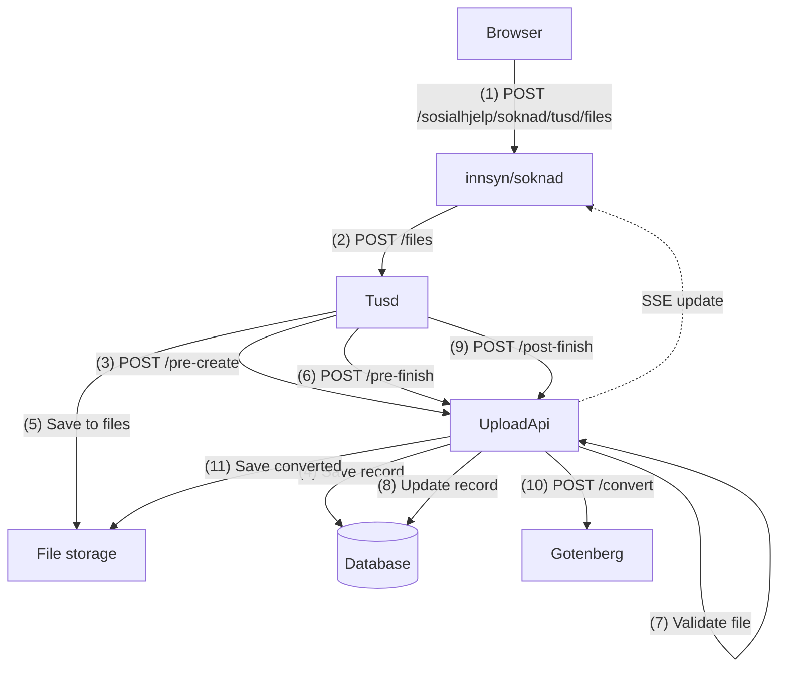

# sosialhjelp-upload

Sosialhjelp-upload er en app som har ansvar for å håndtere og koordinere filopplastinger fra teamdigisos sine publikumstjenester: sosialhjelp-innsyn og sosialhjelp-soknad.

Tjenesten bruker [Tusd](https://tus.io/) og Google Cloud Storage (buckets) for å håndtere selve filopplastingen, og [Gotenberg](https://gotenberg.dev/) for å konvertere filer til PDF.

Filene tilgjengeliggjøres for brukerne ved hjelp av SignedUrl fra Google Cloud Storage, som gir midlertidig tilgang til filene uten å måtte proxye dem via api-et vårt.

## tusd

Tusd er en open source server for resumable filopplasting basert på [tus-protokollen](https://tus.io/protocols/resumable-upload.html). I sosialhjelp-upload brukes tusd til å motta og lagre filer, og
til å trigge hooks for å validere, konvertere og håndtere metadata. Konfigurasjon av tusd skjer via docker-compose og miljøvariabler. Tusd melder fra til denne appen underveis i opplastingen
via [hooks](https://tus.github.io/tusd/advanced-topics/hooks/). Vi bruker følgende:

- PreCreate - Kalles før opplastingen starter. Her opprettes en record i databasen for filen som skal lastes opp.
- PreFinish - Kalles før opplastingen er ferdig, og er blocking. Her validerer vi filen.
- PostFinish - Kalles etter at opplastingen er ferdig. Her konverterer vi til pdf.
- PreTerminate - Kalles før en opplasting slettes. Her sjekker vi autorisasjon.
- PostTerminate - Kalles etter at en opplasting er slettet. Her sletter vi i databasen.

## Wonderwall

Wonderwall er en autentiseringsproxy som beskytter tjenesten og sikrer at kun autoriserte brukere får tilgang til filopplasting og relaterte API-er. Wonderwall håndterer OIDC-autentisering og
videresender gyldige tokens til sosialhjelp-upload. Konfigureres via docker compose.

## Google Cloud buckets

Filer lagres i Google Cloud Storage buckets. Hver opplasting får en unik ID og lagres i en bucket definert av miljøvariabler. Tilgang til bucket styres via service account og IAM-roller. Bucket-navn
og credentials settes via miljøvariabler. Service account-en må opprettes manuelt i Google Cloud Console, og man må lage en api-nøkkel, lagre det som en secret og injecte inn i appen. Dette gjøres på følgende måte:

1. Gå til [Google Cloud Console](https://console.cloud.google.com/).
2. Velg prosjektet ditt.
3. Naviger til "IAM & Admin" > "Service Accounts".
4. Klikk på "Create Service Account".
5. Gi service account-en et navn og en beskrivelse, og klikk "Create".
6. Tildel nødvendige roller: "Storage Admin" for tilgang til buckets og "Service Account Token Creator" for å kunne generere tokens for [SignedUrl](https://cloud.google.com/storage/docs/access-control/signed-urls).
7. Klikk "Continue" og deretter "Done".
8. Finn service account-en i listen, klikk på de tre prikkene til høyre og velg "Manage keys".
9. Klikk på "Add Key" > "Create new key".
10. Velg JSON som nøkkeltype og klikk "Create". En JSON-fil lastes ned til din datamaskin.
11. Lagre denne filen som en secret i kubernetes
12. Inject secret-en som en fil i appen og sett miljøvariabelen `GCP_CREDENTIALS` til path-en der filen er injectet.
13. Sett cors-policy på bucket-en for å tillate opplasting fra frontend. Dette kan gjøres via Google Cloud Console eller `gsutil`-verktøyet. Eksempel med `gsutil`:

```bash
gsutil cors set cors-config.json gs://your-bucket-name
```

## Building & Running

Appen krever database, tusd, gotenberg, wonderwall og mock-alt-api (hvis det skal sendes inn dokumenter).

Tusd, databasen og gotenberg kan startes ved hjelp av docker compose:

```bash
  docker compose up -d
```

Lokalt brukes ikke GCS, men filene lagres lokalt i en mappe. Default her er ./tusd-data. Dette kan overstyres ved å sette miljøvariabelen `storage.basePath`.

Resterende tjenester kan startes opp ved hjelp av docker compose i [digisos-docker-compose](https://github.com/navikt/digisos-docker-compose)

## Database
Appen bruker PostgreSQL som database og JOOQ for databaseoperasjoner. For typesafe SQL-spørringer brukes JOOQ sin kodegenerator som genererer Java-klasser basert på database-skjemaet. Kommandoen for å generere JOOQ-klasser er:

```bash
./gradlew generateJooq
```

Denne kommandoen krever at databasen kjører og at `DB_URL`, `DB_USER` og `DB_PASSWORD` er satt i miljøet, samt at flyway har kjørt nødvendige migreringer.

### DB-migrering
Flyway brukes for database-migreringer. Migreringer kjøres automatisk ved oppstart av appen. Migreringsskriptene ligger i `src/main/resources/db/migration`.

## Flyt



## Environment Variables

- `GCP_BUCKET_NAME`: Navn på Google Cloud Storage bucket.
- `GCP_CREDENTIALS`: Path til service account credentials.
- `TUSD_HOOK_URL`: URL for tusd hooks.
- `DB_URL`: Database connection string.
- `WONDERWALL_ISSUER`: OIDC issuer for Wonderwall.
- Flere variabler kan være relevante, se docker-compose og kildekode for detaljer.

## Contributing

Pull requests og issues er velkomne! Følg NAVs retningslinjer for open source og inkluder tester for nye funksjoner.

## License

Se LICENSE-fil for gjeldende lisens.
