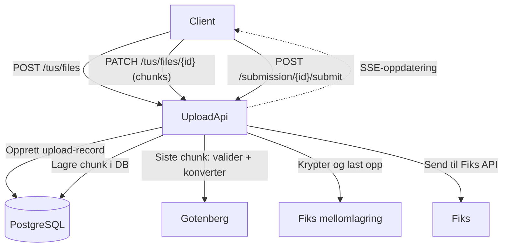

# sosialhjelp-upload

Sosialhjelp-upload er en app som håndterer og koordinerer filopplastinger fra teamdigisos sine publikumstjenester: sosialhjelp-innsyn og sosialhjelp-soknad.

Tjenesten implementerer [tus-protokollen](https://tus.io/protocols/resumable-upload.html) direkte for å ta imot filer i deler (resumable uploads), og bruker [Gotenberg](https://gotenberg.dev/) for å konvertere filer til PDF. Ferdig behandlede filer krypteres og lagres i KS Fiks mellomlagring.

## Kjernekonsepter

- **Submission** — en gruppe opplastinger som sendes inn samlet (f.eks. for en sak). Identifiseres eksternt med en `externalId` fra frontend.
- **Upload** — en enkeltfil innenfor en submission. Representerer én TUS-opplasting.

## Flyt


```mermaid
flowchart TD
    app[Client]
    db[(PostgreSQL)]
    mellomlager[Fiks mellomlagring]

    app -- "POST /tus/files" --> UploadApi
    UploadApi -- "Opprett upload-record" --> db
    app -- "PATCH /tus/files/{id} (chunks)" --> UploadApi
    UploadApi -- "Lagre chunk i DB" --> db
    UploadApi -- "Siste chunk: valider + konverter" --> Gotenberg
    UploadApi -- "Krypter og last opp" --> mellomlager
    UploadApi -. "SSE-oppdatering" .-> app
    app -- "POST /submission/{id}/submit" --> UploadApi
    UploadApi -- "Send til Fiks API" --> Fiks
```

### Opplastingsløp steg for steg

1. Frontend POST-er til `/tus/files` med metadata → appen oppretter en `upload`-record og returnerer en `Location`-header
2. Frontend sender filen i deler via PATCH `/tus/files/{id}`
3. Etter siste chunk kjøres `processCompletedUpload()`:
   - Filtype valideres med Apache Tika, størrelse sjekkes, virusskanning via ClamAV
   - Ikke-PDF/bilde-formater konverteres til PDF via Gotenberg
   - Filen krypteres (CMS i prod, no-op lokalt)
   - Kryptert fil lastes opp til Fiks mellomlagring
4. Frontend mottar sanntidsoppdateringer via SSE på `/status/{externalId}`
5. Bruker sender inn via POST `/submission/{submissionId}/submit` → filen meldes inn til Fiks API

## Autentisering og tilgangskontroll

Alle ruter under `/sosialhjelp/upload/` er beskyttet av JWT via [Wonderwall](https://doc.nais.io/security/auth/wonderwall/). Unntaket er `/internal/isAlive`.

JWT-validering krever:
- `acr`-claim må være `idporten-loa-high`
- `client_id`-claim må matche konfigurert audience

Eierskapssjekk skjer automatisk via route-scoped Ktor-plugins (`OwnershipInterceptors.kt`) — rutehandlere trenger ikke gjøre manuelle sjekker.

## Bygge og kjøre

```bash
# Start lokale avhengigheter (PostgreSQL på :54322, Gotenberg på :3010)
docker compose up -d

# Kjør alle tester (krever Docker for Testcontainers)
./gradlew test

# Bygg fat jar
./gradlew build

# Kjør lokalt
./gradlew run -Pdevelopment

# Regenerer JOOQ-klasser etter skjemaendringer (krever PostgreSQL på :54322)
./gradlew generateJooq
```

Gradle krever GitHub-credentials for NAVs private pakkeregister. Sett disse i `~/.gradle/gradle.properties`:
```properties
githubUser=<ditt-github-brukernavn>
githubPassword=<ditt-github-token>
```

I CI settes de som `ORG_GRADLE_PROJECT_githubUser` og `ORG_GRADLE_PROJECT_githubPassword`.

## Database

- PostgreSQL med JOOQ for typesikre spørringer og Flyway for migreringer
- Migreringsskript ligger i `src/main/resources/db/migration/` og følger `V{major}.{minor}__{beskrivelse}.sql`
- JOOQ-genererte klasser er committed under `database/generated/` og regenereres med `./gradlew generateJooq` ved skjemaendringer
- `SubmissionNotificationService` bruker Postgres LISTEN/NOTIFY og en Kotlin `SharedFlow` for å sende sanntidsoppdateringer til SSE-abonnenter

## Miljøvariabler

| Variabel | Formål |
|----------|--------|
| `RUNTIME_ENV` | `local`/`mock`/`dev`/`prod` — styrer mock vs. ekte kryptering |
| `POSTGRES_JDBC_URL`, `POSTGRES_USERNAME`, `POSTGRES_PASSWORD` | Database |
| `IDPORTEN_CLIENT_ID`, `IDPORTEN_ISSUER`, `IDPORTEN_JWKS_URI` | JWT-autentisering |
| `GOTENBERG_URL` | PDF-konverteringstjeneste |
| `FIKS_URL`, `INTEGRASJONSID_FIKS`, `INTEGRASJONPASSORD_FIKS` | KS Fiks-integrasjon |
| `CLAMAV_URL` | Virusskanning |
| `NAIS_TOKEN_ENDPOINT` | Texas Maskinporten-tokenendepunkt |

## Lisens

Se LICENSE-filen.

