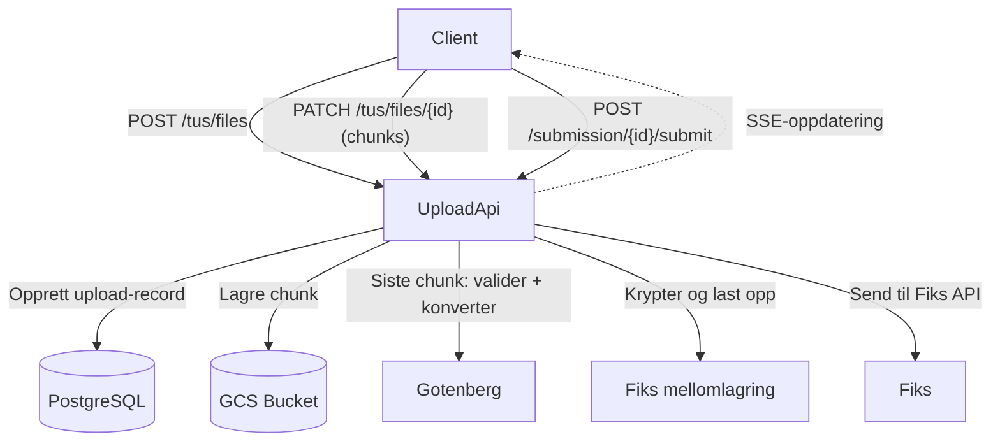

# sosialhjelp-upload

Sosialhjelp-upload håndterer og koordinerer filopplastinger fra teamdigisos sine publikumstjenester: sosialhjelp-innsyn og sosialhjelp-soknad.

Tjenesten implementerer [TUS-protokollen](https://tus.io/protocols/resumable-upload.html) for å ta imot filer i deler (resumable uploads). Ferdig behandlede filer valideres, konverteres til PDF via [Gotenberg](https://gotenberg.dev/), krypteres og lagres i KS Fiks mellomlagring.

## Kjernekonsepter

- **Submission** — en gruppe opplastinger som sendes inn samlet (f.eks. for en sak). Identifiseres eksternt med en `externalId` fra frontend.
- **Upload** — en enkeltfil innenfor en submission. Representerer én TUS-opplasting.

## Flyt


```mermaid
flowchart TD
    app[Client]
    db[(PostgreSQL)]
    gcs[(GCS Bucket)]
    mellomlager[Fiks mellomlagring]

    app -- "POST /tus/files" --> UploadApi
    UploadApi -- "Opprett upload-record" --> db
    app -- "PATCH /tus/files/{id} (chunks)" --> UploadApi
    UploadApi -- "Lagre chunk" --> gcs
    UploadApi -- "Siste chunk: valider + konverter" --> Gotenberg
    UploadApi -- "Krypter og last opp" --> mellomlager
    UploadApi -. "SSE-oppdatering" .-> app
    app -- "POST /submission/{id}/submit" --> UploadApi
    UploadApi -- "Send til Fiks API" --> Fiks
```

### Opplastingsløp steg for steg

1. Frontend POST-er til `/tus/files` med metadata → appen oppretter en `upload`-record og returnerer en `Location`-header
2. Frontend sender filen i deler via PATCH `/tus/files/{id}` — hvert chunk strømmes til GCS
3. Etter siste chunk kjøres `processCompletedUpload()` asynkront:
   - Filtype valideres med Apache Tika, størrelse sjekkes, virusskanning via ClamAV
   - Ikke-PDF/bilde-formater konverteres til PDF via Gotenberg
   - Filen krypteres (CMS/PKCS#7 i prod, no-op lokalt)
   - Kryptert fil lastes opp til Fiks mellomlagring
4. Frontend mottar sanntidsoppdateringer via SSE på `/status/{externalId}`
5. Bruker sender inn via POST `/submission/{submissionId}/submit` → filen meldes inn til Fiks API

## Tech stack

| Lag | Teknologi |
|-----|-----------|
| Språk | Kotlin 2.x / Java 21 |
| Rammeverk | Ktor 3 (Netty) |
| Database | PostgreSQL 17 (Cloud SQL), JOOQ, Flyway, HikariCP |
| Fillagring | Google Cloud Storage (chunks + midlertidig lagring) |
| Filvalidering | Apache Tika, PDFBox, ClamAV |
| PDF-konvertering | Gotenberg |
| Kryptering | CMS/PKCS#7 via BouncyCastle (ks-kryptering) |
| Metrikker | Micrometer + Prometheus |
| Tracing | OpenTelemetry (NAIS auto-instrumentering) |
| Plattform | NAIS (GCP) |

## API-endepunkter

Alle ruter under base-path `/sosialhjelp/upload`.

| Metode | Sti | Auth | Beskrivelse |
|--------|-----|------|-------------|
| `GET` | `/internal/isAlive` | — | Liveness/readiness-probe |
| `GET` | `/metrics-micrometer` | — | Prometheus-metrikker |
| `GET` | `/status/{id}` | ID-porten JWT | SSE-strøm med sanntidsoppdateringer for en submission |
| `GET` | `/upload/{uploadId}` | ID-porten JWT | Hent en behandlet fil fra Fiks mellomlagring |
| `POST` | `/submission/{submissionId}/submit` | ID-porten JWT | Send inn ettersendelse-bunten til Fiks API |
| `OPTIONS` | `/tus/files` | ID-porten JWT | TUS protocol discovery |
| `POST` | `/tus/files` | ID-porten JWT | Opprett en ny TUS-opplasting |
| `HEAD` | `/tus/files/{id}` | ID-porten JWT | Hent nåværende offset/lengde |
| `PATCH` | `/tus/files/{id}` | ID-porten JWT | Legg til et chunk |
| `DELETE` | `/tus/files/{id}` | ID-porten JWT | Avbryt/slett en opplasting |
| `GET` | `/vedlegg/{navEksternRefId}` | TokenX (M2M) | Returner `JsonVedleggSpesifikasjon`; kalles av sosialhjelp-soknad-api |

## Autentisering og tilgangskontroll

- **ID-porten JWT** — alle brukerrettede ruter krever gyldig JWT med `acr=idporten-loa-high` og riktig `client_id`-audience
- **TokenX** — `/vedlegg`-ruten er maskin-til-maskin og krever gyldig TokenX-token; brukes av `sosialhjelp-soknad-api`
- **Maskinporten** — brukes internt for å hente token mot KS Fiks API via Texas

Eierskapssjekk skjer automatisk via route-scoped Ktor-plugins (`OwnershipInterceptors.kt`) — rutehandlere trenger ikke gjøre manuelle sjekker.

## Bygge og kjøre

```bash
# Start lokale avhengigheter (PostgreSQL på :54322, Gotenberg på :3010)
docker compose up -d

# Kjør alle tester (krever Docker for Testcontainers)
./gradlew test

# Tester med coverage-rapport
./gradlew test jacocoTestReport

# Lint (ktlint + Detekt)
./gradlew ktlintCheck detekt

# Bygg fat jar
./gradlew build

# Kjør lokalt i development-modus (mock-kryptering, filsystem-lagring)
./gradlew run -Pdevelopment

# Regenerer JOOQ-klasser etter skjemaendringer (krever PostgreSQL på :54322)
./gradlew generateJooq
```

Gradle krever GitHub-credentials for NAVs private pakkeregister. Sett disse i `~/.gradle/gradle.properties`:

```properties
githubUser=<ditt-github-brukernavn>
githubPassword=<ditt-github-token>
```

I CI settes de som `ORG_GRADLE_PROJECT_githubUser` og `ORG_GRADLE_PROJECT_githubPassword`.

## Database

- PostgreSQL med JOOQ for typesikre spørringer og Flyway for migreringer
- Migreringsskript ligger i `src/main/resources/db/migration/` og følger `V{major}.{minor}__{beskrivelse}.sql`
- JOOQ-genererte klasser er committed under `database/generated/` og regenereres med `./gradlew generateJooq` ved skjemaendringer
- `SubmissionNotificationService` bruker PostgreSQL `LISTEN/NOTIFY` og en Kotlin `SharedFlow` for å sende sanntidsoppdateringer til SSE-abonnenter

## Opprydding og retention

Tjenesten kjører periodiske oppryddingsjobber:

| Jobb | Timeout | Handling |
|------|---------|----------|
| **Stuck uploads** | 3 minutter | Opplastinger som står i `PENDING` eller `PROCESSING` i mer enn 3 minutter markeres som `FAILED`. Brukeren kan deretter forkaste dem selv via UI. |
| **Stale submissions** | 1 time | Submissions som ikke har blitt sendt inn og ikke har hatt aktivitet på 1 time slettes automatisk, inkludert tilhørende filer i GCS og mellomlagring. |

GCS-bucketen har i tillegg en lifecycle-regel som sletter objekter etter 1 dag som siste sikkerhetsnett.

## Miljøvariabler

| Variabel | Formål |
|----------|--------|
| `RUNTIME_ENV` | `local`/`mock`/`dev`/`prod` — styrer mock vs. ekte kryptering og lagring |
| `POSTGRES_JDBC_URL`, `POSTGRES_USERNAME`, `POSTGRES_PASSWORD` | Database (injiseres av NAIS Cloud SQL) |
| `IDPORTEN_CLIENT_ID`, `IDPORTEN_ISSUER`, `IDPORTEN_JWKS_URI` | ID-porten JWT-validering |
| `TOKEN_X_CLIENT_ID`, `TOKEN_X_ISSUER`, `TOKEN_X_JWKS_URI` | TokenX-validering (M2M) |
| `GCS_BUCKET_NAME` | GCS-bucket for chunk- og midlertidig fillagring |
| `GOTENBERG_URL` | PDF-konverteringstjeneste |
| `FIKS_URL`, `INTEGRASJONSID_FIKS`, `INTEGRASJONPASSORD_FIKS` | KS Fiks-integrasjon |
| `CLAMAV_URL` | Virusskanning |
| `NAIS_TOKEN_ENDPOINT` | Texas Maskinporten-tokenendepunkt |
| `CLEAN_ON_START` | `true` — tømmer og remigrer DB ved oppstart (kun mock-miljø) |

## Deployment

Tjenesten deployes til NAIS (GCP) via GitHub Actions:

| Miljø | Cluster | Workflow |
|-------|---------|----------|
| Prod | `prod-gcp` | Push til `main` → `deploy-prod.yml` |
| Dev | `dev-gcp` | Manuell dispatch → `deploy-dev.yml` |
| Mock | `dev-gcp` | Manuell dispatch → `deploy-dev.yml` |

Alle miljøer rebuildes daglig kl. 02:00 UTC via `restart-all-envs.yml` for å sikre ferske base-images og hemmeligheter.

## Lisens

Se LICENSE-filen.
